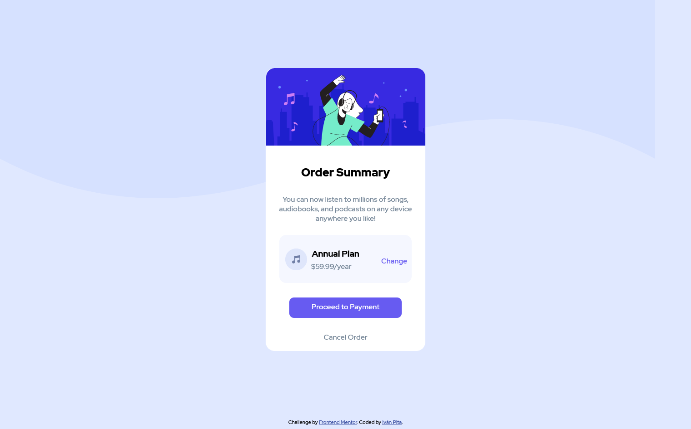

# Frontend Mentor - Order summary card solution

This is a solution to the [Order summary card challenge on Frontend Mentor](https://www.frontendmentor.io/challenges/order-summary-component-QlPmajDUj). Frontend Mentor challenges help you improve your coding skills by building realistic projects. 

## Table of contents

- [Overview](#overview)
  - [The challenge](#the-challenge)
  - [Screenshot](#screenshot)
  - [Links](#links)
- [My process](#my-process)
  - [Built with](#built-with)
  - [What I learned](#what-i-learned)
  - [Continued development](#continued-development)
  - [Useful resources](#useful-resources)
- [Author](#author)
- [Acknowledgments](#acknowledgments)

## Overview

### The challenge

Users should be able to:

✔️- See hover states for interactive elements

### Screenshot




### Links

- Live Site URL: [Order Summary Card](https://order-summary-component-newbieproject.netlify.app/)

### Built with

- Semantic HTML5 markup
- CSS custom properties
- CSS Grid

### What I learned

I learnt about media queries so I can apply some custom style depending on the screen size. This background changing for example:
```css
@media (max-width: 375px) {
    body{
        background-image: url("../images/pattern-background-mobile.svg");
    }
}
```
I also learnt about SVG managing, and what I consider MOST important, I practiced and recap my web development knowledge; I applied concepts that I had seen, and it might not be my best job, but I'm happy with how it all turned out.

### Continued development

I've got to continue learning about CSS Grid until I'm confident using it, so I can move forward to flexbox or some other CSS tools.

### Useful resources

- [MDN Media Queries](https://developer.mozilla.org/en-US/docs/Web/CSS/Media_Queries/Using_media_queries) - This helped me on changing the background image depending on the screen size.
## Author

- Website - [Iván Pita](https://muzu-u.github.io/cv/)
- Facebook - [Iván Pita](https://www.facebook.com/ivan.pita.unu/)
